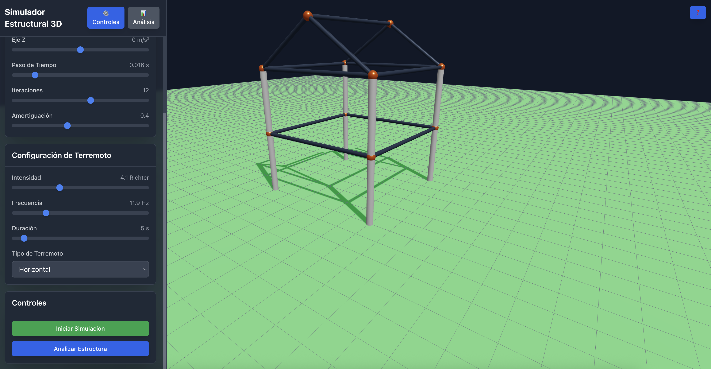

# Simulador Estructural 3D Avanzado

Un simulador profesional de estructuras 3D con física realista para análisis de resistencia sísmica y comportamiento estructural.



## 🏗️ Características Principales

### Simulación Física Avanzada
- **Física realista**: Motor de física basado en React Three Cannon
- **Simulación de terremotos**: Múltiples tipos de sismos (horizontal, vertical, rotacional)
- **Perfiles estructurales realistas**: IPE, HEA, HEB con dimensiones exactas
- **Materiales reales**: Propiedades físicas de acero S235/S355 y hormigón C25/C30

### Análisis Estructural
- **Cálculo de desplazamientos**: Deformaciones máximas en tiempo real
- **Análisis de esfuerzos**: Tensiones en elementos estructurales
- **Factor de seguridad**: Evaluación automática de resistencia
- **Elementos críticos**: Identificación de puntos débiles
- **Recomendaciones**: Sugerencias de mejora estructural

### Interfaz Profesional
- **Arquitectura atómica**: Componentes modulares y reutilizables
- **Panel de control avanzado**: Configuración detallada de simulación
- **Visualización 3D**: Escena interactiva con controles de cámara
- **Modos de visualización**: Wireframe, sólido, esfuerzos, deformaciones

## 🚀 Tecnologías Utilizadas

- **React 19** - Framework de interfaz de usuario
- **TypeScript** - Tipado estático para mayor robustez
- **Three.js** - Renderizado 3D
- **React Three Fiber** - Integración React-Three.js
- **React Three Cannon** - Motor de física
- **Tailwind CSS** - Framework de estilos
- **Lucide React** - Iconografía moderna

## 📦 Instalación

```bash
# Clonar el repositorio
git clone <repository-url>
cd gemini-3d-structural-simulator

# Instalar dependencias
pnpm install

# Ejecutar en modo desarrollo
pnpm dev

# Construir para producción
pnpm build
```

## 🎮 Uso del Simulador

### Controles de Cámara
- **Clic y arrastrar**: Rotar la cámara alrededor de la estructura
- **Rueda del ratón**: Zoom in/out
- **Clic derecho + arrastrar**: Pan de la cámara

### Configuración de Simulación
1. **Gravedad**: Ajustar vectores de gravedad en X, Y, Z
2. **Paso de tiempo**: Controlar precisión de la simulación
3. **Iteraciones**: Número de cálculos por frame
4. **Amortiguación**: Reducir vibraciones

### Simulación de Terremotos
1. **Intensidad**: 0-12 escala Richter
2. **Frecuencia**: 0.1-50 Hz (frecuencia de vibración)
3. **Duración**: 1-60 segundos
4. **Tipo**: Horizontal, Vertical, Rotacional

### Análisis Estructural
- Ejecutar análisis automático para obtener:
  - Desplazamientos máximos
  - Esfuerzos críticos
  - Factor de seguridad
  - Elementos críticos
  - Recomendaciones de mejora

## 🏛️ Estructura del Proyecto

```
src/
├── atoms/           # Componentes básicos (Button, Slider, Card)
├── molecules/       # Componentes compuestos (ControlPanel, AnalysisPanel)
├── organisms/       # Componentes complejos (StructuralScene)
├── templates/       # Layouts principales (SimulatorLayout)
├── hooks/           # Lógica de negocio (useStructuralSimulator)
├── types/           # Definiciones de TypeScript
├── constants/       # Constantes y configuraciones
├── services/        # Servicios externos
└── utils/           # Utilidades generales
```

## 🧪 Estructura Modelada

### Edificio de 2 Pisos
- **9 nodos estructurales** principales
- **16 vigas** con perfiles IPE realistas
- **8 columnas** con perfiles HEA
- **4 fundaciones** de hormigón armado
- **Materiales**: Acero S235 y hormigón C25

### Perfiles Estructurales
- **IPE**: Vigas con geometría exacta (IPE80-IPE600)
- **HEA**: Columnas con secciones estándar (HEA100-HEA1000)
- **Dimensiones reales**: Espesores, anchos y alturas precisos

## 📊 Análisis y Resultados

### Métricas Calculadas
- **Desplazamientos**: Deformaciones en milímetros
- **Esfuerzos**: Tensiones en MPa
- **Factor de Seguridad**: Ratio resistencia/carga
- **Elementos Críticos**: Identificación automática

### Visualización
- **Modo sólido**: Vista realista de la estructura
- **Modo esfuerzos**: Coloreado por nivel de tensión
- **Modo deformaciones**: Visualización de desplazamientos
- **Modo wireframe**: Vista esquemática

## 🔧 Configuración Avanzada

### Materiales Disponibles
- **Acero S235**: fy = 235 MPa, E = 210 GPa
- **Acero S355**: fy = 355 MPa, E = 210 GPa
- **Hormigón C25**: fc = 25 MPa, E = 30 GPa
- **Hormigón C30**: fc = 30 MPa, E = 33 GPa
- **Aluminio 6061**: fy = 240 MPa, E = 69 GPa

### Tipos de Suelo
- **Roca**: Resistencia 1000 kPa
- **Suelo duro**: Resistencia 500 kPa
- **Suelo medio**: Resistencia 250 kPa
- **Suelo blando**: Resistencia 100 kPa
- **Suelo muy blando**: Resistencia 50 kPa

## 🎯 Funcionalidades Futuras

- [ ] Importación de modelos CAD
- [ ] Análisis modal
- [ ] Optimización automática
- [ ] Exportación de reportes
- [ ] Simulación de viento
- [ ] Análisis de fatiga
- [ ] Integración con códigos de diseño

## 📝 Licencia

Este proyecto está bajo la Licencia MIT. Ver el archivo `LICENSE` para más detalles.

## 🤝 Contribuciones

Las contribuciones son bienvenidas. Por favor, abre un issue o pull request para sugerencias y mejoras.

## 📞 Contacto

Para preguntas o soporte, contacta al equipo de desarrollo.
